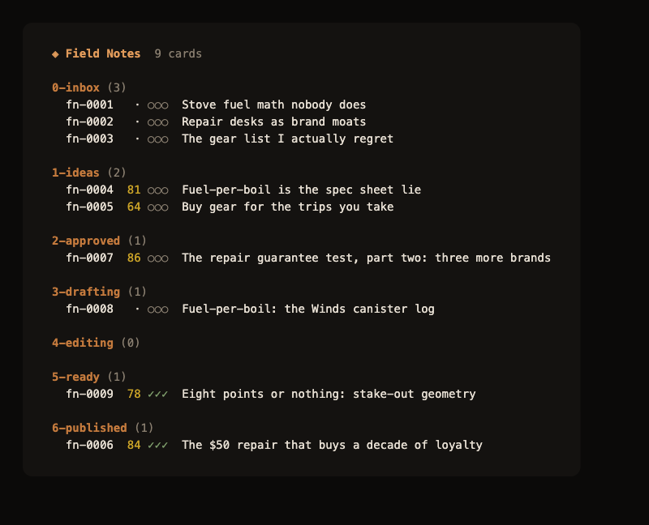
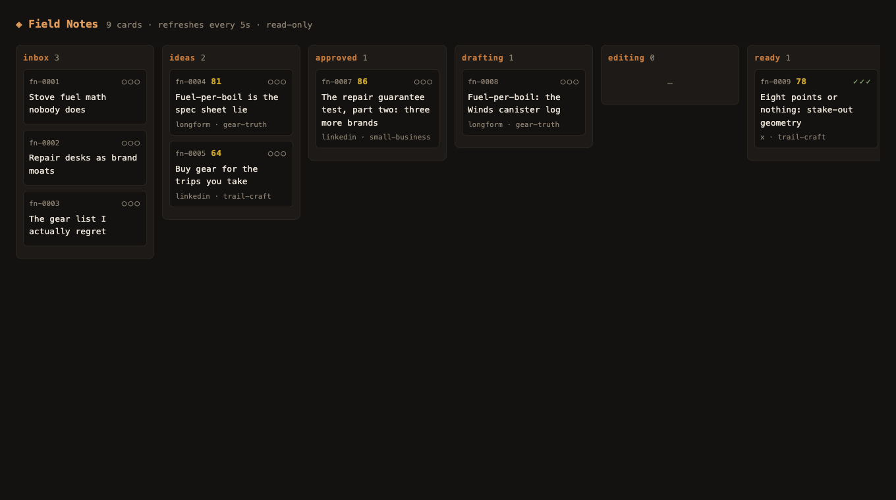

<div align="center">


<p><code>The local-first editorial studio for one distinctive voice</code></p>

**Filesystem board · evidence-quoted voice spec · gates instead of a humanizer · memory mined from your own edits**

[](#the-eval)
[](package.json)
[](https://github.com/dhalarewich/writers-room/releases)
[](#install)
[](#hosts)
[](LICENSE)

[Install](#install) · [Set up](#set-up-your-first-studio) · [Daily use](#daily-use) · [Voice memory](#the-voice-memory-loop) · [Eval](#the-eval) · [Hosts](#hosts)

</div>

---

A Claude Code plugin plus a small CLI, running entirely on your filesystem — no server, no database, no API keys, nothing to deploy.

The board is folders. The cards are markdown. The voice spec is distilled from pieces you actually published, with every rule quoting its evidence. Mechanical AI tells are counted by code, not vibes. And every hand-edit you make before publishing is captured as a diff and mined back into memory — the system gets more *you* every time you correct it.

**The stance:** one voice, quality over volume. Most content tooling mass-produces text, then bolts a "humanizer" on the end to sand off the slop. Writers Room never needs one, because it is built to protect a real person's voice rather than manufacture a synthetic one. If a piece doesn't read unmistakably like its author, it doesn't ship.

## How it works

A **studio** is a folder you own. Each project folder is its own independent board:

```
my-studio/
  studio.yml            # name, channels, pillars, thresholds, feeds
  board/
    0-inbox/            # raw captures — drop .md/.txt files here from anywhere
    1-ideas/            # split, positioned, scored
    2-approved/         # you promoted it: worth drafting
    3-drafting/  4-editing/
    5-ready/            # you edit here, in your own editor, as much as you like
    6-published/
  vault/
    voice/style-dna.md        # how you write — every rule cites one of your samples
    voice/banned-patterns.md  # phrase bans + mechanical ceilings, machine-enforced
    voice/samples/            # the real pieces the spec was distilled from
    bio.md                    # facts about you — the anti-hallucination anchor
    strategy.md  rubric.md    # who it's for, what scores
    knowledge/                # your subject-matter notes, plain markdown
  memory/
    learnings.md        # append-only corrections — the voice memory
    edits/              # diffs of your hand-edits, captured at ship time
```

<div align="center">

</div>

A card's stage **is** its folder — there is no second copy of the truth. Each card carries the working draft plus a `## Dossier`: positioning, rubric score, a per-claim fact table, the edit log, the voice-gate report, and a `Pulled` list showing exactly which vault files each stage consulted and why. The card is the whole handoff: no hidden state, no transcript archaeology. Retrieval is a table of contents you can read (`vault/INDEX.md`), wiki-links, and lexical search — no embeddings, fully auditable.

Six agents, decomposed by *context boundary* rather than job title — a fresh context is spent only where anchoring is the failure mode:

| Agent | Job |
|---|---|
| Scout | mines sources, splits captures into distinct positioned ideas |
| Critic | scores against your rubric; critique gate on finished pieces — never shares the maker's context |
| Fact-Checker | bio first, vault second, web last; per-claim table with confidence tiers |
| Writer | drafts as you — voice embodiment is the whole job |
| Editor | density, hook, close; the Writer's designed adversary |
| Warden | the voice gate: tool-counted de-slop sweep + fidelity verdict, always last |

Plus the Muse, who lives in the main conversation: a Socratic interviewer that can stop at a sharp idea card, or midwife an entire piece assembled from *your own sentences* in the transcript.

Every piece passes three gates before it reaches `5-ready/`: facts, critique, voice. Nothing ever auto-publishes — `5-ready → published` is yours alone.

## Install

Prerequisites: [Claude Code](https://claude.com/claude-code) and Node 20+.

Add the plugin in Claude Code:

```
/plugin marketplace add dhalarewich/plugins
/plugin install writers-room@halarewich
```

Then install the `wr` CLI — the deterministic substrate the agents drive:

```bash
npm i -g @dhalarewich/writers-room
```

`wr --help` lists the verbs. (To hack on the CLI itself, clone the repo and run `npm install && npm run build && npm link` instead.)

## Set up your first studio

```bash
mkdir ~/writing/my-studio && cd ~/writing/my-studio
wr init . --name "My Studio" --prefix ms
```

Then open Claude Code in that folder and run **`/setup`**. Bring 3–8 pieces you actually published — the ones where a friend would say "this sounds exactly like you." Setup interviews you and:

- distills your **Style DNA** from the samples — every rule must quote a sample line ("no sample line, no rule");
- **measures** your mechanical ceilings (em dashes, contrast-snaps) from your real pieces instead of guessing;
- asks "what do you delete on sight?" and turns every answer into a machine-enforced phrase ban;
- asks "what has AI gotten wrong about you before?" and turns every answer into a Fact-Checker guardrail;
- fills strategy (north star, audiences, what counts as a winner) and the scoring rubric.

It takes 15–20 minutes and is fully resumable — **`wr doctor`** shows what's seeded and what's still template, so you can stop anytime and pick up later. The router refuses to ghostwrite on an unseeded studio.

**Second board?** Every folder is its own studio. `/setup --from ~/writing/first-studio` carries your voice (style DNA, bans, samples, bio) over in two minutes; pillars, strategy, and feeds stay per-board.

## Daily use

**The board flows left to right.** Every card starts in `0-inbox` and moves one column rightward until it ships. Your whole job is deciding what advances.

```
inbox → ideas →│ approved → drafting → editing → ready │→ published
               ▲                                        ▲
          your call:                              your call:
        "worth drafting"                          "publish it"
```

**Two of those arrows are yours alone.** Everything *between* them the pipeline drives — `/write` runs a card from `approved` through the three gates to `ready` on its own. But the two human gates never move without you: promoting `ideas → approved` ("this is worth drafting") and `ready → published` ("publish this"). `/write --auto` can cross the first when a score clears your threshold; nothing automated ever crosses the second.

**Moving a card is its own small act** — separate from the work a stage does. Three ways, whichever's in reach:

| To move a card | Do this | When |
|---|---|---|
| **Just ask Claude** | "move ms-7 to approved" | you're in a Claude Code session |
| **Terminal** | `wr move ms-7 approved` | you're in the shell |
| **Drag the file** | drag its `.md` between `board/` folders in Finder, or on the web board | you're looking at the board |

All three do the same thing: the card's `.md` file physically moves from one `board/` folder to the next. The folder **is** the stage — there's no other state to touch.

Five verbs in Claude Code:

| Command | What it does |
|---|---|
| `/feed` | stocks the inbox: your published winners, RSS, pillar gaps, stale backlog, theme clusters, dormant knowledge — plus one *provocation* (a real tension between things you've said) |
| `/muse` | dialogue engine. Seed depth: digs out what you actually think, leaves a sharp card. Piece depth: keeps going through structure and argument to a finished piece assembled from your own words (`--cowrite` to let it write connective prose) |
| `/write` | pipeline engine: fact brief → draft → edit → three gates → `5-ready/`. Single card, batch, `--auto` (score-threshold promotion), or `--table` (round-table treatment for high-stakes pieces) |
| `/ship` | your publish gate. Recaps gates and the Editor's bet, runs `wr ship` — which diffs the agent-final text against what you actually shipped. `--analytics` logs performance later |
| `/learn` | closes the loop: classifies your pushback, re-runs the one responsible stage, and mines your ship-time edit diffs into rules (each citing its diff as evidence) |

The rhythm: `/feed` or `/muse` → review the scored ideas → move what you believe in to `2-approved/` → `/write` → edit the piece in `5-ready/` with your own hands → `/ship` → `/learn` when you've corrected something.

From the terminal, `wr` covers everything without a model: `wr board` (themed render), `wr studio` (full-screen TUI), `wr serve` (read-only web board — loads in Claude Code desktop's browser pane), `wr sweep <id>` (count the AI tells in any text), `wr check` (schema lint), `wr doctor` (onboarding state), `wr find` / `wr index` (vault search), `wr adopt` (turn stray notes into cards). A statusline script in `statusline/` shows live pipeline state.

Try it with zero setup: `fixtures/demo-studio/` is a complete studio with a synthetic voice — `cd fixtures/demo-studio && wr studio`. The same board in the read-only web view (`wr serve`, loads in Claude Code desktop's browser pane):

<div align="center">

</div>

## The voice memory loop

Three channels feed `memory/learnings.md`:

1. **You say so** — notes on a card, classified and routed by `/learn`.
2. **Onboarding** — `/setup` distills the starting spec from published pieces.
3. **Your hands** — when a card enters `5-ready/`, the agent-final text is snapshotted; when you ship, the diff is captured and mined into rules. Rules that hold graduate into the style DNA, or become regex-enforced bans — the best fate for a correction is becoming a mechanical check.

## The eval

The six-context lineup is a hypothesis, not a belief. `wr eval` runs seed cards (reverse-engineered from real published pieces, identical pre-verified fact briefs for both sides) through the lineup and through one well-prompted solo agent, scores both mechanically (`wr sweep`) and by a blind judge against the real published references, and writes the report. This repo's lineup decision cites those numbers — see [docs/EVAL-RESULTS.md](docs/EVAL-RESULTS.md), including the incident where the eval caught the pipeline leaking its own scaffolding into a piece. Run it on your own studio; if solo ties lineup for your voice, use fewer contexts.

## Hosts

Built as a **Claude Code** plugin today. The substrate is deliberately host-agnostic: the board, vault, and memory are plain markdown operated through the `wr` CLI, and every agent behavior is a markdown instruction file — nothing in the working system depends on a specific model host except the thin packaging (`.claude-plugin/`, `skills/`, `commands/`, `agents/`).

Porting to **Codex** (or any CLI agent) means: an AGENTS.md router mirroring `skills/writers-room/SKILL.md`, custom prompts mirroring `commands/`, and running the pipeline stages as separate headless CLI calls instead of subagents — a pattern the eval harness already uses (each stage is an isolated call with a file-assembled prompt, which preserves the fresh-context property the gates depend on). The eval runner's engine binary is overridable via `WR_ENGINE`. Contributions welcome.

## What this is not

No scheduler, no multi-platform distribution, no analytics dashboards, no vector database, no growth hacks. It writes with you and protects your voice; you publish. That's the job.

## License

MIT
