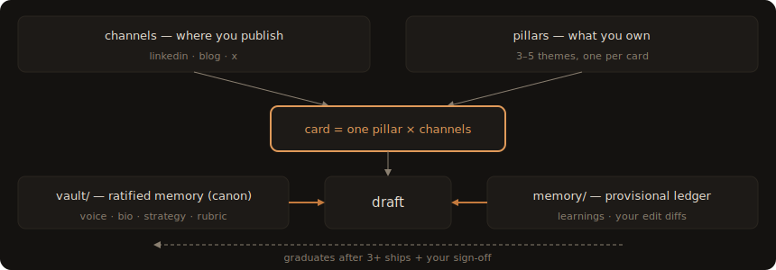
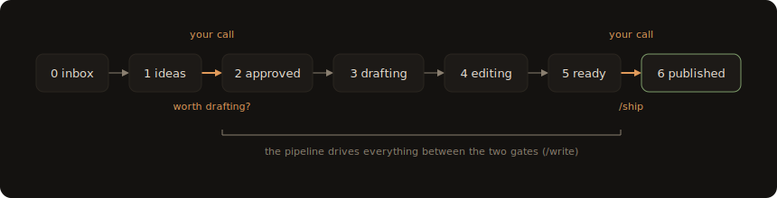

<div align="center">


<p><code>The local-first editorial studio for one distinctive voice</code></p>

**A kanban board for your writing · AI that drafts in your voice · quality gates before anything ships · learns from your edits**

[](#the-eval)
[](package.json)
[](https://github.com/dhalarewich/writers-room/releases)
[](#install)
[](#hosts)
[](LICENSE)

[Install](#install) · [Set up](#set-up-your-first-studio) · [Daily use](#daily-use) · [Voice memory](#the-voice-memory-loop) · [Eval](#the-eval) · [Hosts](#hosts)

</div>

---

Writers Room is a Claude Code plugin (plus a small `wr` CLI) for writing with AI in your own voice. Your pipeline is a kanban board of plain markdown files on your own disk: ideas land in an inbox, move through drafting and editing, pass three quality gates — facts, critique, voice — and leave as published pieces. No server, no database, no API keys.

The voice part is the point. The AI drafts as you, checked against a spec distilled from pieces you actually published. Mechanical AI tells are counted by code, not vibes. Every hand-edit you make before publishing is captured as a diff and mined back into memory — the system gets more *you* with every piece. Most content tools mass-produce text, then bolt a "humanizer" on the end to sand off the slop; Writers Room never needs one, because if a piece doesn't read unmistakably like its author, it doesn't ship.

## How it works

A **studio** is a folder you own. Each project folder is its own independent board:

```
my-studio/
  studio.yml            # name, channels, pillars, thresholds, feeds
  board/
    0-inbox/            # raw captures — drop .md/.txt files here from anywhere
    1-ideas/            # split, positioned, scored
    2-approved/         # you promoted it: worth drafting
    3-drafting/  4-editing/
    5-ready/            # you edit here, in your own editor, as much as you like
    6-published/
  vault/
    voice/style-dna.md        # how you write — every rule cites one of your samples
    voice/banned-patterns.md  # phrase bans + mechanical ceilings, machine-enforced
    voice/samples/            # the real pieces the spec was distilled from
    bio.md                    # facts about you — the anti-hallucination anchor
    strategy.md  rubric.md    # who it's for, what scores
    knowledge/                # your subject-matter notes, plain markdown
  memory/
    learnings.md        # append-only corrections — the voice memory
    edits/              # diffs of your hand-edits, captured at ship time
```

- **Channels** — where you publish: `linkedin`, `blog`, whatever `studio.yml` lists.
- **Pillars** — the 3–5 themes you own. `/feed` hunts gaps per pillar; the rubric scores how well a piece ladders back to one.
- **Vault** — ratified memory. Facts and rules you've signed off on: bio, strategy, rubric, style DNA, samples. Agents read it as truth; it changes only on purpose.
- **Memory** — provisional memory. A machine-written, append-only ledger, every rule citing its evidence. Rules earn their way into the vault through ships survived and your sign-off — nothing drifts in silently.

<div align="center"></div>

<div align="center"></div>

A card's stage **is** its folder — there is no second copy of the truth. Each card carries the working draft plus a `## Dossier`: positioning, rubric score, a per-claim fact table, the edit log, the voice-gate report, and a `Pulled` list of which vault files each stage consulted and why. Retrieval is a table of contents you can read (`vault/INDEX.md`), wiki-links, and lexical search — no embeddings, fully auditable.

Six agents, decomposed by *context boundary* rather than job title — a fresh context is spent only where anchoring is the failure mode:

| Agent | Job |
|---|---|
| Scout | mines sources, splits captures into distinct positioned ideas |
| Critic | scores against your rubric; critique gate on finished pieces — never shares the maker's context |
| Fact-Checker | bio first, vault second, web last; per-claim table with confidence tiers |
| Writer | drafts as you — voice embodiment is the whole job |
| Editor | density, hook, close; the Writer's designed adversary |
| Warden | the voice gate: tool-counted de-slop sweep + fidelity verdict, always last |

Plus the Muse, who lives in the main conversation: a Socratic interviewer that can stop at a sharp idea card, or keep going to a finished piece built only from sentences you actually said in the transcript.

Every piece passes three gates before it reaches `5-ready/`: facts, critique, voice. Nothing ever auto-publishes — `5-ready → published` is yours alone.

## Install

Prerequisites: [Claude Code](https://claude.com/claude-code) and Node 20+.

Add the plugin in Claude Code:

```
/plugin marketplace add dhalarewich/plugins
/plugin install writers-room@halarewich
```

Then install the `wr` CLI — the deterministic substrate the agents drive:

```bash
npm i -g @dhalarewich/writers-room
```

`wr --help` lists the verbs. (To hack on the CLI itself, clone the repo and run `npm install && npm run build && npm link` instead.)

## Set up your first studio

```bash
mkdir ~/writing/my-studio && cd ~/writing/my-studio
wr init . --name "My Studio" --prefix ms
```

Then open Claude Code in that folder and run **`/setup`**. Bring 3–8 pieces you actually published — the ones where a friend would say "this sounds exactly like you." Setup interviews you and:

- distills your **Style DNA** from the samples — every rule must quote a sample line ("no sample line, no rule");
- **measures** your mechanical ceilings (em dashes, contrast-snaps) from your real pieces instead of guessing;
- asks "what do you delete on sight?" and turns every answer into a machine-enforced phrase ban;
- asks "what has AI gotten wrong about you before?" and turns every answer into a Fact-Checker guardrail;
- fills strategy (north star, audiences, what counts as a winner) and the scoring rubric.

It takes 15–20 minutes and is fully resumable — **`wr doctor`** shows what's seeded and what's still template, so you can stop anytime and pick up later. The router refuses to ghostwrite on an unseeded studio.

**Second board?** Every folder is its own studio. `/setup --from ~/writing/first-studio` carries your voice (style DNA, bans, samples, bio) over in two minutes; pillars, strategy, and feeds stay per-board.

## A week with it

A walkthrough on the demo studio (`fixtures/demo-studio`, prefix `fn`) — the same board pictured above, played out over five days.

**Monday, `/feed`.** It stocks the inbox from every viable source and hands back a ranked list:

```
fn-0004  Fuel-per-boil is the spec sheet lie          81  gear-truth
  honest line: the canister log is the piece; without it this is a take
fn-0005  Buy gear for the trips you take               64  trail-craft
  honest line: needs the actual audit numbers to clear 72
```

You read both. `fn-0005` is short of the auto-promote threshold, but you've already run the trip-log audit it's asking for — worth drafting anyway, and that call is yours to make, not the score's:

```
wr move fn-0005 approved
```

**Tuesday, `/write fn-0005`.** It runs the fact brief, draft, and edit passes and closes with the report `/write` always gives — gate states plus the Editor's Bet, a falsifiable line about how the piece will land:

```
fn-0005  Buy gear for the trips you take → 5-ready/
  gates: facts passed · critique passed · voice passed
  Editor's Bet: comments beat shares here — this reads as confession, not advice
```

**Wednesday**, before anything ships, you open `board/5-ready/fn-0005-*.md` in your own editor, cut two sentences the Editor left in, then run `/ship fn-0005` — the recap, the one question that keeps the voice loop alive, and the result:

```
Buy gear for the trips you take · linkedin · facts/critique/voice: passed
Editor's Bet: comments beat shares here — this reads as confession, not advice

Is the card text exactly what went (or is going) live? Paste the final
version, or say `as-is`.
> as-is

⇥ fn-0005 published
  hand edits captured → memory/edits/fn-0005.diff
  run /learn to mine them into voice memory
```

Two hunks in that diff — the two sentences you cut.

**Friday, `/learn`.** It mines the diff and appends a rule, evidence attached — the same append-only ledger `memory/learnings.md` already holds entries like this in:

```
1 diff mined, 1 rule appended:
"Cut the hedge before the numbers — the confession lands harder cold."
```

## Daily use

**The board flows left to right.** Every card starts in `0-inbox` and moves one column rightward until it ships. Your whole job is deciding what advances.

<div align="center"></div>

**Two of those arrows are yours alone.** Everything *between* them the pipeline drives on its own — `/write` runs a card from `approved` through the three gates to `ready`. But the two human gates never move without you — promoting `ideas → approved` and `ready → published` — and while `/write --auto` can cross the first when a score clears your threshold, nothing automated ever crosses the second.

**Moving a card is its own small act** — separate from the work a stage does. Three ways, whichever's in reach:

| To move a card | Do this | When |
|---|---|---|
| **Just ask Claude** | "move ms-7 to approved" | you're in a Claude Code session |
| **Terminal** | `wr move ms-7 approved` | you're in the shell |
| **Drag the file** | drag its `.md` between `board/` folders in Finder, or on the web board | you're looking at the board |

All three do the same thing: the card's `.md` file physically moves from one `board/` folder to the next. The folder **is** the stage — there's no other state to touch.

Five verbs in Claude Code:

| Command | What it does |
|---|---|
| `/feed` | stocks the inbox — all viable sources by default, or focus it in plain words ("just my feeds", "find gaps", "something provocative"). Sources: your published winners, RSS, pillar gaps, stale backlog, theme clusters, dormant knowledge — plus one *provocation* (a real tension between things you've said) |
| `/muse` | dialogue engine. Seed depth: digs out what you actually think, leaves a sharp card. Piece depth: keeps going through structure and argument to a finished piece assembled from your own words (`--cowrite` to let it write connective prose) |
| `/write` | pipeline engine: fact brief → draft → edit → three gates → `5-ready/`. Single card, batch, `--auto` (score-threshold promotion), or `--table` (round-table treatment for high-stakes pieces) |
| `/ship` | your publish gate. Recaps gates and the Editor's bet, runs `wr ship` — which diffs the agent-final text against what you actually shipped. `--analytics` logs performance later |
| `/learn` | closes the loop: classifies your pushback, re-runs the one responsible stage, and mines your ship-time edit diffs into rules (each citing its diff as evidence) |

The rhythm: `/feed` or `/muse` → review the scored ideas → move what you believe in to `2-approved/` → `/write` → edit the piece in `5-ready/` with your own hands → `/ship` → `/learn` when you've corrected something.

From the terminal, `wr` covers everything without a model: `wr capture "thought"` (quick capture to inbox from anywhere; `--set-default` once to make a studio the target), `wr board` (themed render), `wr studio` (full-screen TUI), `wr serve` (web board — drag cards between stages, open a card, archive, ship with paste-back; loads in Claude Code desktop's browser pane), `wr sweep <id>` (count the AI tells in any text), `wr check` (schema lint), `wr doctor` (onboarding state), `wr find` / `wr index` (vault search), `wr adopt` (turn stray notes into cards). A statusline script in `statusline/` shows live pipeline state.

Try it with zero setup: `fixtures/demo-studio/` is a complete studio with a synthetic voice — `cd fixtures/demo-studio && wr studio`. The same board in the web view (`wr serve`, loads in Claude Code desktop's browser pane):

<div align="center"></div>

## Getting things in

Capture has to be instant and judgment-free — no positioning, no scoring, no deciding if it's good. That thinking happens later, at the `/feed` split. Right now the only job is not losing the thought.

```bash
wr capture "fuel math nobody does"
```

Run it once inside a studio with `--set-default` and captures from anywhere land there, no `cd` required:

```bash
wr capture --set-default
```

It also reads stdin, and can carry its source along:

```bash
# anything that can pipe text can capture
pbpaste | wr capture -

# --url appends the link as its own trailing paragraph
wr capture "the repair math cuts both ways" --url https://example.com/thread
```

A few ways to make capture instant on whatever you carry:

- **macOS Shortcut or share sheet** — a shortcut that pipes selected text or a URL into a `wr capture` shell action, callable from anywhere the share sheet shows up.
- **Raycast script command** — bind a hotkey to a script that shells out to `wr capture "$1"`.
- **Phone** — sync the studio folder (iCloud Drive, Syncthing) and save `.md` files into `board/0-inbox/` from any notes app; `/feed` adopts and splits them like anything else.

Anything that writes a file is a capture client. No account, no API, no server.

## The voice memory loop

Three channels feed `memory/learnings.md`:

1. **You say so** — notes on a card, classified and routed by `/learn`.
2. **Onboarding** — `/setup` distills the starting spec from published pieces.
3. **Your hands** — when a card enters `5-ready/`, the agent-final text is snapshotted; when you ship, the diff is captured and mined into rules. Rules that hold graduate into the style DNA, or become regex-enforced bans — the best fate for a correction is becoming a mechanical check.

## The eval

The six-context lineup is a hypothesis, not a belief. `wr eval` runs seed cards (reverse-engineered from real published pieces, identical pre-verified fact briefs for both sides) through the lineup and through one well-prompted solo agent, scores both mechanically (`wr sweep`) and by a blind judge against the real published references, and writes the report. This repo's lineup decision cites those numbers — see [docs/EVAL-RESULTS.md](docs/EVAL-RESULTS.md), including the incident where the eval caught the pipeline leaking its own scaffolding into a piece. Run it on your own studio; if solo ties lineup for your voice, use fewer contexts.

## Hosts

Built as a **Claude Code** plugin today. The substrate is deliberately host-agnostic: the board, vault, and memory are plain markdown operated through the `wr` CLI, and every agent behavior is a markdown instruction file — nothing in the working system depends on a specific model host except the thin packaging (`.claude-plugin/`, `skills/`, `commands/`, `agents/`).

Porting to **Codex** (or any CLI agent) means: an AGENTS.md router mirroring `skills/writers-room/SKILL.md`, custom prompts mirroring `commands/`, and running the pipeline stages as separate headless CLI calls instead of subagents — a pattern the eval harness already uses (each stage is an isolated call with a file-assembled prompt, which preserves the fresh-context property the gates depend on). The eval runner's engine binary is overridable via `WR_ENGINE`. Contributions welcome.

## What this is not

No scheduler, no multi-platform distribution, no analytics dashboards, no vector database, no growth hacks. It writes with you and protects your voice; you publish. That's the job.

## License

MIT
